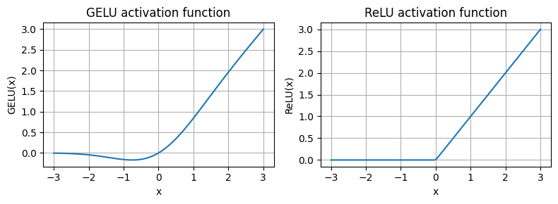

##### 本章脉络


### 4.1 LLM基础架构（GPT backbone）

Coding 最小 GPT-2 模型（1.24 亿个参数）的架构，参考 [Language Models are Unsupervised Multitask Learners](https://cdn.openai.com/better-language-models/language_models_are_unsupervised_multitask_learners.pdf) 

```python
GPT_CONFIG_124M = {
    "vocab_size": 50257,    # Vocabulary size
    "context_length": 1024, # Context length
    "emb_dim": 768,         # Embedding dimension
    "n_heads": 12,          # Number of attention heads
    "n_layers": 12,         # Number of layers
    "drop_rate": 0.1,       # Dropout rate
    "qkv_bias": False       # Query-Key-Value bias
}
```

- `vocab_size` ：词汇量为 50,257 个单词，BPE（Byte-pair Encoding）tokenizer

- `context_length` ：模型的最大输入Token数
- `emb_dim` ：Embedding维度，将每个输入Token转换为 768 维向量
- `n_heads` ：多头注意机制中的多头数
- `n_layers` ：transformer block数量
- `drop_rate` ：随机丢弃率
- `qkv_bias` ：决定多头注意力机制中的 `Linear` 层在计算查询（Q）、键（K）和值（V）张量时是否应包含偏差向量，禁用是现代 LLM 中的标准做法（第 5 章中将 OpenAI 的预训练 GPT-2 权重加载重新讨论）

```python
# 简单实现, DummyTransformerBlock和DummyLayerNorm均不做任何操作

import torch
import torch.nn as nn


class DummyGPTModel(nn.Module):
    def __init__(self, cfg):
        super().__init__()
        self.tok_emb = nn.Embedding(cfg["vocab_size"], cfg["emb_dim"])
        self.pos_emb = nn.Embedding(cfg["context_length"], cfg["emb_dim"])
        self.drop_emb = nn.Dropout(cfg["drop_rate"])
        
        # Use a placeholder for TransformerBlock
        self.trf_blocks = nn.Sequential(
            *[DummyTransformerBlock(cfg) for _ in range(cfg["n_layers"])])
        
        # Use a placeholder for LayerNorm
        self.final_norm = DummyLayerNorm(cfg["emb_dim"])
        self.out_head = nn.Linear(
            cfg["emb_dim"], cfg["vocab_size"], bias=False
        )

    def forward(self, in_idx):
        batch_size, seq_len = in_idx.shape
        tok_embeds = self.tok_emb(in_idx)
        pos_embeds = self.pos_emb(torch.arange(seq_len, device=in_idx.device))
        x = tok_embeds + pos_embeds
        x = self.drop_emb(x)
        x = self.trf_blocks(x)
        x = self.final_norm(x)
        logits = self.out_head(x)
        return logits


class DummyTransformerBlock(nn.Module):
    def __init__(self, cfg):
        super().__init__()
        # A simple placeholder

    def forward(self, x):
        # This block does nothing and just returns its input.
        return x


class DummyLayerNorm(nn.Module):
    def __init__(self, normalized_shape, eps=1e-5):
        super().__init__()
        # The parameters here are just to mimic the LayerNorm interface.

    def forward(self, x):
        # This layer does nothing and just returns its input.
        return x


# 测试输出是否正常
import tiktoken
tokenizer = tiktoken.get_encoding("gpt2")
batch = []
txt1 = "Every effort moves you"
txt2 = "Every day holds a"
batch.append(torch.tensor(tokenizer.encode(txt1)))
batch.append(torch.tensor(tokenizer.encode(txt2)))
batch = torch.stack(batch, dim=0)
print(batch)
"""
tensor([[6109, 3626, 6100,  345],
        [6109, 1110, 6622,  257]]) torch.Size([2, 4])
"""

torch.manual_seed(123)
model = DummyGPTModel(GPT_CONFIG_124M)
logits = model(batch)
print("Output shape:", logits.shape)
# Output shape: torch.Size([2, 4, 50257])
```

### 4.2 Layer normalization

Layer normalization，也称为 LayerNorm ([Ba et al. 2016](https://arxiv.org/abs/1607.06450))，将数据集中在平均值 0 附近，并将其方差归一化为 1，这可以稳定训练并更快地收敛到有效权重，**应用于 Transformer 块中的多头注意模块之前和之后，也应用于最终输出层之前**


```python
# 普通实现

torch.manual_seed(123)
batch_example = torch.randn(2, 5) 
layer = nn.Sequential(nn.Linear(5, 6), nn.ReLU())
out = layer(batch_example)
print(out)
"""
tensor([[0.2260, 0.3470, 0.0000, 0.2216, 0.0000, 0.0000],
        [0.2133, 0.2394, 0.0000, 0.5198, 0.3297, 0.0000]],
       grad_fn=<ReluBackward0>)
"""

mean = out.mean(dim=-1, keepdim=True)
var = out.var(dim=-1, keepdim=True)
print("Mean:\n", mean)
print("Variance:\n", var)
"""
Mean:
 tensor([[0.1324],
        [0.2170]], grad_fn=<MeanBackward1>)
Variance:
 tensor([[0.0231],
        [0.0398]], grad_fn=<VarBackward0>)
"""

out_norm = (out - mean) / torch.sqrt(var)
print("Normalized layer outputs:\n", out_norm)
mean = out_norm.mean(dim=-1, keepdim=True)
var = out_norm.var(dim=-1, keepdim=True)
print("Mean:\n", mean)
print("Variance:\n", var)
"""
Normalized layer outputs:
 tensor([[ 0.6159,  1.4126, -0.8719,  0.5872, -0.8719, -0.8719],
        [-0.0189,  0.1121, -1.0876,  1.5173,  0.5647, -1.0876]],
       grad_fn=<DivBackward0>)
Mean:
 tensor([[-5.9605e-08],
        [ 1.9868e-08]], grad_fn=<MeanBackward1>)
Variance:
 tensor([[1.0000],
        [1.0000]], grad_fn=<VarBackward0>)
"""
```

```python
# 类实现

class LayerNorm(nn.Module):
    def __init__(self, emb_dim):
        super().__init__()
        self.eps = 1e-5
        self.scale = nn.Parameter(torch.ones(emb_dim))
        self.shift = nn.Parameter(torch.zeros(emb_dim))

    def forward(self, x):
        mean = x.mean(dim=-1, keepdim=True)
        var = x.var(dim=-1, keepdim=True, unbiased=False)
        norm_x = (x - mean) / torch.sqrt(var + self.eps)
        # scale shift [emb_dim] --> [1, 1, emb_dim] --> [batch_size, context_length, emb_dim]
        return self.scale * norm_x + self.shift
      
ln = LayerNorm(emb_dim=5)
out_ln = ln(batch_example)
mean = out_ln.mean(dim=-1, keepdim=True)
var = out_ln.var(dim=-1, unbiased=False, keepdim=True)
print("Mean:\n", mean)
print("Variance:\n", var)
"""
Mean:
 tensor([[-0.0000],
        [0.0000]], grad_fn=<MeanBackward1>)
Variance:
 tensor([[1.0000],
        [1.0000]], grad_fn=<VarBackward0>)
"""
```

**Scale and Shift**

- 除了通过减去平均值并除以方差来执行标准化之外，还添加了两个可训练参数，即 `scale` 和 `shift` 参数
- 初始 `scale`（乘以 1）和 `shift`（添加 0）值没有任何影响；但 `scale` 和 `shift` 是可训练参数，如果确定这样做会提高模型在训练任务上的性能，LLM 会在训练期间自动调整这些参数，这使得模型能够学习最适合其正在处理的数据的适当缩放和移位
- 在计算方差的平方根之前，我们还添加了一个较小的值 `eps`，这是为了避免方差为 0 时出现除以零的错误

**Biased variance**

- 在上面方差计算中，设置 `unbiased=False` 意味着使用公式 $\frac{\sum_i (x_i - \bar{x})^2}{n}$ 计算方差，其中 n 是样本大小（此处为特征或列的数量）；此公式不包括贝塞尔校正（分母中使用 `n-1`），因此提供了方差的有偏估计
- 对于 LLM，嵌入维度 `n` 非常大，使用 `n` 和 `n-1` 之间的差异可以忽略不计
- GPT-2 在规范化层中使用有偏方差进行训练，因此采用此设置以兼容后面章节中加载的预训练权重

### 4.3 GELU and feed forword

- 在深度学习中，ReLU（整流线性单元）激活函数因其在各种神经网络架构中的简单性和有效性而被广泛使用
- 在 LLM 中，除了传统的 ReLU 之外，还使用了各种其他类型的激活函数；两个值得注意的例子是 GELU（高斯误差线性单元）和 SwiGLU（Swish 门控线性单元）。GELU 和 SwiGLU 是更复杂、更平滑的激活函数，分别包含高斯和 S 形门控线性单元，与更简单的分段线性函数 ReLU 不同，它们为深度学习模型提供了更好的性能
  - GELU ([Hendrycks and Gimpel 2016](https://arxiv.org/abs/1606.08415)) 可以通过多种方式实现；确切版本定义为 $GELU(x)=x⋅Φ(x)$，其中 $Φ(x)$ 是标准高斯分布的累积分布函数。
  - 在实践中，通常实现一种计算上更易计算的近似值：$\text{GELU}(x) \approx 0.5 \cdot x \cdot \left(1 + \tanh\left[\sqrt{\frac{2}{\pi}} \cdot \left(x + 0.044715 \cdot x^3\right)\right]\right)
  $（原始 GPT-2 模型也使用此近似值进行训练）

```python
class GELU(nn.Module):
    def __init__(self):
        super().__init__()

    def forward(self, x):
        return 0.5 * x * (1 + torch.tanh(
            torch.sqrt(torch.tensor(2.0 / torch.pi)) * 
            (x + 0.044715 * torch.pow(x, 3))
        ))

import matplotlib.pyplot as plt

gelu, relu = GELU(), nn.ReLU()
x = torch.linspace(-3, 3, 100)
y_gelu, y_relu = gelu(x), relu(x)

plt.figure(figsize=(8, 3))
for i, (y, label) in enumerate(zip([y_gelu, y_relu], ["GELU", "ReLU"]), 1):
    # enumerate参数1的作用是i从1开始计数
    plt.subplot(1, 2, i)
    plt.plot(x, y)
    plt.title(f"{label} activation function")
    plt.xlabel("x")
    plt.ylabel(f"{label}(x)")
    plt.grid(True)

plt.tight_layout()
plt.show()
```



```python
class FeedForward(nn.Module):
    def __init__(self, cfg):
        super().__init__()
        self.layers = nn.Sequential(
            nn.Linear(cfg["emb_dim"], 4 * cfg["emb_dim"]),
            GELU(),
            nn.Linear(4 * cfg["emb_dim"], cfg["emb_dim"]),
        )

    def forward(self, x):
        return self.layers(x)

ffn = FeedForward(GPT_CONFIG_124M)  # emb_size = 768
x = torch.rand(2, 3, 768)  # input shape: [batch_size, num_token, emb_size]
out = ffn(x)
print(out.shape)
# torch.Size([2, 3, 768])
```

<center class="half">    
  
  
</center>

### 4.4 Shortcut connection（ResNet）

```python
class ExampleDeepNeuralNetwork(nn.Module):
    def __init__(self, layer_sizes, use_shortcut):
        super().__init__()
        self.use_shortcut = use_shortcut
        self.layers = nn.ModuleList([
            nn.Sequential(nn.Linear(layer_sizes[0], layer_sizes[1]), GELU()),
            nn.Sequential(nn.Linear(layer_sizes[1], layer_sizes[2]), GELU()),
            nn.Sequential(nn.Linear(layer_sizes[2], layer_sizes[3]), GELU()),
            nn.Sequential(nn.Linear(layer_sizes[3], layer_sizes[4]), GELU()),
            nn.Sequential(nn.Linear(layer_sizes[4], layer_sizes[5]), GELU())
        ])

    def forward(self, x):
        for layer in self.layers:
            # Compute the output of the current layer
            layer_output = layer(x)
            # Check if shortcut can be applied
            if self.use_shortcut and x.shape == layer_output.shape:
                x = x + layer_output
            else:
                x = layer_output
        return x


def print_gradients(model, x):
    # Forward pass
    output = model(x)
    target = torch.tensor([[0.]])

    # Calculate loss based on how close the target
    # and output are
    loss = nn.MSELoss()
    loss = loss(output, target)
    
    # Backward pass to calculate the gradients
    loss.backward()

    for name, param in model.named_parameters():
        if 'weight' in name:
            print(f"{name} has gradient mean of {param.grad.abs().mean().item()}")

# 对比有无shortcut的梯度大小
layer_sizes = [3, 3, 3, 3, 3, 1]  
sample_input = torch.tensor([[1., 0., -1.]])
torch.manual_seed(123)
model_without_shortcut = ExampleDeepNeuralNetwork(
    layer_sizes, use_shortcut=False
)
print_gradients(model_without_shortcut, sample_input)
torch.manual_seed(123)
model_with_shortcut = ExampleDeepNeuralNetwork(
    layer_sizes, use_shortcut=True
)
print_gradients(model_with_shortcut, sample_input)
"""
layers.0.0.weight has gradient mean of 0.00020173587836325169
layers.1.0.weight has gradient mean of 0.0001201116101583466
layers.2.0.weight has gradient mean of 0.0007152041653171182
layers.3.0.weight has gradient mean of 0.001398873864673078
layers.4.0.weight has gradient mean of 0.005049646366387606

layers.0.0.weight has gradient mean of 0.22169792652130127
layers.1.0.weight has gradient mean of 0.20694105327129364
layers.2.0.weight has gradient mean of 0.32896995544433594
layers.3.0.weight has gradient mean of 0.2665732502937317
layers.4.0.weight has gradient mean of 1.3258541822433472
"""
```

梯度是损失函数相对于每个模型参数的偏导数，表示了模型参数的微小变化对损失函数的影响，假设求最后一层 $(w5, b5)$ 和倒数第二层 $(w4, b4)$。**结论：最后一层不变，之前层的梯度都会增加**

**无残差连接：**

$y1 = w1 * x1 + b1, y1g = GELU(y1)$
$y2 = w2 * y1g + b2, y2g = GELU(y2)$
$y3 = w3 * y2g + b3, y3g = GELU(y3)$
$y4 = w4 * y3g + b4, y4g = GELU(y4)$
$y5 = w5 * y4g + b5, yf = GELU(y5)$
$Loss = (yf - target) ** 2$
$∂L / ∂yf = 2(yf - target)$
$∂L / ∂w5 = (∂L / ∂yf) * (∂yf / ∂y5) * (∂y5 / ∂w5) = 2(yf - target) * GELU'(y5) * y4g$
$∂L / ∂b5 = (∂L / ∂yf) * (∂yf / ∂y5) * (∂y5 / ∂b5) = 2(yf - target) * GELU'(y5) * 1$
$∂L / ∂w4 = (∂L / ∂yf) * (∂yf / ∂y5) * (∂y5 / ∂y4g) * (∂y4g / ∂y4) * (∂y4 / ∂w4) = 2(yf - target) * GELU'(y5) * w5 * GELU'(y4) * y3g$
$∂L / ∂b4 = (∂L / ∂yf) * (∂yf / ∂y5) * (∂y5 / ∂y4g) * (∂y4g / ∂y4) * (∂y4 / ∂b4) = 2(yf - target) * GELU'(y5) * w5 * GELU'(y4) * 1$

**有残差连接：**

$y1 = w1 * x1 + b1, y1g = GELU(y1) + x1$
$y2 = w2 * y1g + b2, y2g = GELU(y2) + y1g$
$y3 = w3 * y2g + b3, y3g = GELU(y3) + y2g$
$y4 = w4 * y3g + b4, y4g = GELU(y4) + y3g$
$y5 = w5 * y4g + b5, yf = GELU(y5) + y4g$
$Loss = (yf - target) ** 2$
$∂L / ∂yf = 2(yf - target)$
$∂L / ∂w5 = (∂L / ∂yf) * (∂yf / ∂y5) * (∂y5 / ∂w5) = 2(yf - target) * GELU'(y5) * y4g$
$∂L / ∂b5 = (∂L / ∂yf) * (∂yf / ∂y5) * (∂y5 / ∂b5) = 2(yf - target) * GELU'(y5) * 1$
$∂L / ∂w4 = (∂L / ∂yf) * (∂yf / ∂y4g) * (∂y4g / ∂y4) * (∂y4 / ∂w4) = 2(yf - target) * (w5 * GELU'(y5) + 1) * GELU'(y4) * y3g$
$∂L / ∂b4 = (∂L / ∂yf) * (∂yf / ∂y4g) * (∂y4g / ∂y4) * (∂y4 / ∂b4) = 2(yf - target) * (w5 * GELU'(y5) + 1) * GELU'(y4) * 1$

### 4.5 Transformer

```python
# ch3多头类, nn.MultiheadAttention实现
class MultiHeadAttention(nn.Module):
    def __init__(self, d_in, d_out, context_length, dropout, num_heads, qkv_bias=False):
        super().__init__()

        self.d_out = d_out
        self.num_heads = num_heads
        self.mha = nn.MultiheadAttention(embed_dim=d_out, num_heads=num_heads, dropout=dropout)

        self.W_query = nn.Linear(d_in, d_out, bias=qkv_bias)
        self.W_key = nn.Linear(d_in, d_out, bias=qkv_bias)
        self.W_value = nn.Linear(d_in, d_out, bias=qkv_bias)

        self.out_proj = nn.Linear(d_out, d_out)
        self.register_buffer(
            "mask",
            torch.triu(torch.ones(context_length, context_length), diagonal=1)
        )

    def forward(self, x):
        b, num_tokens, d_in = x.shape

        # Apply the projection layers to the input x
        queries = self.W_query(x)  # Shape: (b, num_tokens, d_out)
        keys = self.W_key(x)
        values = self.W_value(x)

        # Reshape the input for nn.MultiheadAttention, which expects (sequence_length, batch_size, embedding_dim)
        queries = queries.transpose(0, 1)  # Shape: (num_tokens, b, d_out)
        keys = keys.transpose(0, 1)
        values = values.transpose(0, 1)

        # Apply causal mask if needed
        attn_mask = self.mask[:num_tokens, :num_tokens].bool()

        # Get the attention output
        attn_output, _ = self.mha(queries, keys, values, attn_mask=attn_mask)

        # Return the output of the attention
        output = attn_output.transpose(0, 1)  # Back to (b, num_tokens, d_out)
        output = self.out_proj(output)

        return output

      
class FeedForward(nn.Module):
    def __init__(self, cfg):
        super().__init__()
        self.layers = nn.Sequential(
            nn.Linear(cfg["emb_dim"], 4 * cfg["emb_dim"]),
            GELU(),
            nn.Linear(4 * cfg["emb_dim"], cfg["emb_dim"]),
        )

    def forward(self, x):
        return self.layers(x)

      
class TransformerBlock(nn.Module):
    def __init__(self, cfg):
        super().__init__()
        self.att = MultiHeadAttention(
            d_in=cfg["emb_dim"],
            d_out=cfg["emb_dim"],
            context_length=cfg["context_length"],
            num_heads=cfg["n_heads"], 
            dropout=cfg["drop_rate"],
            qkv_bias=cfg["qkv_bias"])
        self.ff = FeedForward(cfg)
        self.norm1 = LayerNorm(cfg["emb_dim"])
        self.norm2 = LayerNorm(cfg["emb_dim"])
        self.drop_shortcut = nn.Dropout(cfg["drop_rate"])

    def forward(self, x):
        # Shortcut connection for attention block
        shortcut = x
        x = self.norm1(x)
        x = self.att(x)  # Shape [batch_size, num_tokens, emb_size]
        x = self.drop_shortcut(x)
        x = x + shortcut  # Add the original input back

        # Shortcut connection for feed forward block
        shortcut = x
        x = self.norm2(x)
        x = self.ff(x)
        x = self.drop_shortcut(x)
        x = x + shortcut  # Add the original input back

        return x
   

torch.manual_seed(123)
x = torch.rand(2, 4, 768)   # Shape: [batch_size, num_tokens, emb_dim]
block = TransformerBlock(GPT_CONFIG_124M)
output = block(x)
print("Input shape:", x.shape)
print("Output shape:", output.shape)
"""
Input shape: torch.Size([2, 4, 768])
Output shape: torch.Size([2, 4, 768])
"""
```


### 4.6 GPT

```python
class GPTModel(nn.Module):
    def __init__(self, cfg):
        super().__init__()
        self.tok_emb = nn.Embedding(cfg["vocab_size"], cfg["emb_dim"])
        self.pos_emb = nn.Embedding(cfg["context_length"], cfg["emb_dim"])
        self.drop_emb = nn.Dropout(cfg["drop_rate"])
        
        self.trf_blocks = nn.Sequential(
            *[TransformerBlock(cfg) for _ in range(cfg["n_layers"])])
        
        self.final_norm = LayerNorm(cfg["emb_dim"])
        self.out_head = nn.Linear(
            cfg["emb_dim"], cfg["vocab_size"], bias=False
        )

    def forward(self, in_idx):
        batch_size, seq_len = in_idx.shape
        tok_embeds = self.tok_emb(in_idx)
        pos_embeds = self.pos_emb(torch.arange(seq_len, device=in_idx.device))
        x = tok_embeds + pos_embeds  # Shape [batch_size, num_tokens, emb_size]
        x = self.drop_emb(x)
        x = self.trf_blocks(x)
        x = self.final_norm(x)
        logits = self.out_head(x)
        return logits
      
torch.manual_seed(123)
model = GPTModel(GPT_CONFIG_124M)
out = model(batch)
print("Input batch:\n", batch)
print("\nOutput shape:", out.shape)
print(out)
"""
Input batch:
 tensor([[6109, 3626, 6100,  345],
        [6109, 1110, 6622,  257]])

Output shape: torch.Size([2, 4, 50257])
tensor([[[ 0.3613,  0.4222, -0.0711,  ...,  0.3483,  0.4661, -0.2838],
         [-0.1792, -0.5660, -0.9485,  ...,  0.0477,  0.5181, -0.3168],
         [ 0.7120,  0.0332,  0.1085,  ...,  0.1018, -0.4327, -0.2553],
         [-1.0076,  0.3418, -0.1190,  ...,  0.7195,  0.4023,  0.0532]],

        [[-0.2564,  0.0900,  0.0335,  ...,  0.2659,  0.4454, -0.6806],
         [ 0.1230,  0.3653, -0.2074,  ...,  0.7705,  0.2710,  0.2246],
         [ 1.0558,  1.0318, -0.2800,  ...,  0.6936,  0.3205, -0.3178],
         [-0.1565,  0.3926,  0.3288,  ...,  1.2630, -0.1858,  0.0388]]],
       grad_fn=<UnsafeViewBackward0>)
"""

# 计算参数量
total_params = sum(p.numel() for p in model.parameters())
print(f"Total number of parameters: {total_params:,}")
total_params_gpt2 =  total_params - sum(p.numel() for p in model.out_head.parameters())
print(f"Number of trainable parameters considering weight tying: {total_params_gpt2:,}")
"""
Total number of parameters: 163,009,536
Number of trainable parameters considering weight tying: 124,412,160
"""
```

如上所示，该模型有 163M 个参数，而不是 124M 个参数；为什么？在原始 GPT-2 论文中，研究人员应用了权重绑定，这意味着他们**重用了 token 嵌入层（`tok_emb`）作为输出层**，这意味着设置 `self.out_head.weight = self.tok_emb.weight` ，token 嵌入层将 50,257 维独热编码输入 token 投影到 768 维嵌入表示，输出层将 768 维嵌入投影回 50,257 维表示，因此，嵌入层和输出层具有相同数量的权重参数。（**每个参数 4 字节，163M = 163 * 4 * 1e6 / 1024 / 1024 = 620MB**）

| 大模块 | token_embedding | pos_embedding | tranformer block | tranformer block | tranformer block  | tranformer block | LayerNorm  |     FinalLinear     |     总和     |
| ------ | :-------------: | :-----------: | :--------------: | :--------------: | :---------------: | :--------------: | :--------: | :-----------------: | :----------: |
| 小模块 |     tok_emb     |    pos_emb    |       QKV        |      Linear      |   Feed Forward    |    LayerNorm     | Final Norm |    Final Linear     |      \       |
| 参数量 |   50257 * 768   |  1024 * 768   |  3 * 768 * 768   |    768 * 768     | 4 * 768 * 768 * 2 |   768 * 2 * 2    |  768 * 2   | 768 * 50257（绑定） | 163M（124M） |

**`nn.MultiHeadAttention` 的三x版本比手撕 `MultiHeadAttention` 版本的参数量多 60w 左右，在 GPT-2标准版的实现中体现为最终多了 7million 个参数（12 * 60w），什么原因？？？**

### 4.7 生成文本

所有输入过GPT，选择最后一个Token中概率最大的ID，取对应TokenID的单词作为文本的下一个字


```python
def generate_text_simple(model, idx, max_new_tokens, context_size):
    # idx is (batch, n_tokens) array of indices in the current context
    for _ in range(max_new_tokens):
        
        # Crop current context if it exceeds the supported context size
        # E.g., if LLM supports only 5 tokens, and the context size is 10
        # then only the last 5 tokens are used as context
        idx_cond = idx[:, -context_size:]
        
        # Get the predictions
        with torch.no_grad():
            logits = model(idx_cond)
        
        # Focus only on the last time step
        # (batch, n_tokens, vocab_size) becomes (batch, vocab_size)
        logits = logits[:, -1, :]  

        # Apply softmax to get probabilities
        probas = torch.softmax(logits, dim=-1)  # (batch, vocab_size)

        # Get the idx of the vocab entry with the highest probability value
        idx_next = torch.argmax(probas, dim=-1, keepdim=True)  # (batch, 1)

        # Append sampled index to the running sequence
        idx = torch.cat((idx, idx_next), dim=1)  # (batch, n_tokens+1)

    return idx

# 输出Token
start_context = "Hello, I am"
encoded = tokenizer.encode(start_context)
print("encoded:", encoded)
encoded_tensor = torch.tensor(encoded).unsqueeze(0)
print("encoded_tensor.shape:", encoded_tensor.shape)
"""
encoded: [15496, 11, 314, 716]
encoded_tensor.shape: torch.Size([1, 4])
"""

# eval模式下生成新词
model.eval()  # disable dropout
out = generate_text_simple(
    model=model,
    idx=encoded_tensor, 
    max_new_tokens=6, 
    context_size=GPT_CONFIG_124M["context_length"]
)
print("Output:", out)
print("Output length:", len(out[0]))
"""
Output: tensor([[15496, 11, 314, 716, 27018, 24086, 47843, 30961, 42348, 7267]])
Output length: 10
"""

# 解码结果
decoded_text = tokenizer.decode(out.squeeze(0).tolist())
print(decoded_text)
# Hello, I am Featureiman Byeswickattribute argue
```

### 番外——model.eval()和with torch.no_grad()

model.eval() 影响的是 BN 和 Dropout：

- model.train() 是保证 BN 层用每一批数据的均值和方差，而 model.eval() 是保证 BN 用全部训练数据的均值和方差
- 而对于 Dropout，model.train() 是随机取一部分网络连接来训练更新参数，而 model.eval() 是利用到了所有网络连接

与 with torch.no_grad() 区别：

- model.eval() 模式下，dropout 层会让所有的激活单元都通过，而 BN 层会停止计算和更新 mean 和 var，但 eval 模式不会影响各层的 gradient 计算行为，即 gradient 计算和存储与 training 模式一样，只是不进行反向传播
- with torch.no_grad() 则主要是用于停止 autograd 模块的工作，以起到加速和节省显存的作用，并不会影响 dropout 和 BN 层的行为

```python
# 一般这样用（不用 with torch.no_grad() 也可以, 只是为了节省显存, 但 test 必须 eval 模式否则 BN 和 Dropout 会更新）
def test(model, dataloader):
    model.eval()  # 切换到测试模式
    with torch.no_grad():  # with下内容不进行grad计算
```

